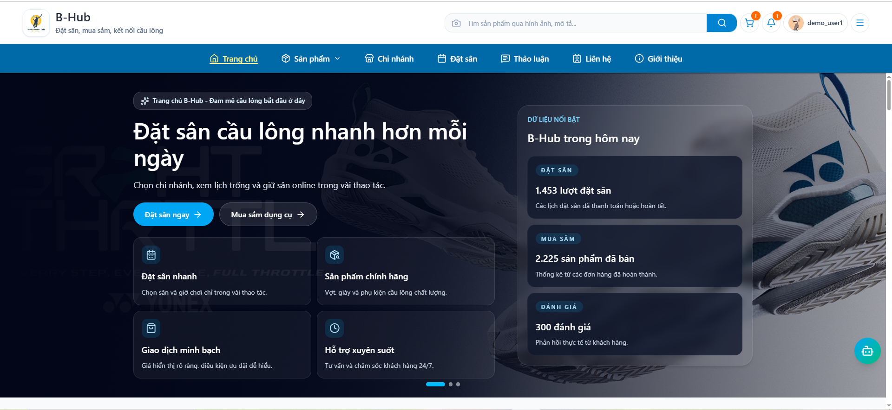

# Phát triển nền tảng Web quản lý chuỗi sân cầu lông đa cơ sở hỗ trợ phân tích dữ liệu và thương mại điện tử

_Dự án KLTN — B-Hub (Badminton Court Booking & Management System)_

[](#) [](#) [](#) [](#)



---

## Mục lục

- [Giới thiệu](#giới-thiệu)
- [Vai trò trong hệ thống](#vai-trò-trong-hệ-thống)
- [Tính năng theo vai trò](#tính-năng-theo-vai-trò)
- [Tính năng nền tảng](#tính-năng-nền-tảng)
- [Dịch vụ AI](#dịch-vụ-ai)
- [Công nghệ](#công-nghệ)
- [Kiến trúc](#kiến-trúc)
- [Cài đặt & chạy dự án](#cài-đặt--chạy-dự-án)
- [Đường dẫn ứng dụng](#đường-dẫn-ứng-dụng)
- [Cấu trúc thư mục](#cấu-trúc-thư-mục)
- [Tác giả](#tác-giả)

---

## Giới thiệu

**B-Hub** là hệ thống web full-stack phục vụ chuỗi cơ sở cầu lông. Nền tảng hỗ trợ khách hàng đặt sân, mua hàng, theo dõi đơn, thanh toán, tham gia cộng đồng, nhắn tin và sử dụng trợ lý AI; đồng thời cung cấp các portal riêng cho nhân viên, quản lý chi nhánh và quản trị viên để vận hành sân, kho, đơn hàng, nhân sự, doanh thu, kiểm duyệt nội dung và phân tích khuyến mãi.

Hệ thống hiện tích hợp **VNPay**, **GHN**, **Cloudinary**, **Email OTP**, **Socket.IO**, **OpenAI API** và các dịch vụ AI nội bộ cho kiểm duyệt nội dung, gợi ý sản phẩm, tìm kiếm sản phẩm bằng hình ảnh/từ khóa và AI Insights.

Dự án được thực hiện trong khuôn khổ **Khóa luận tốt nghiệp** — Khoa Công nghệ Thông tin, Trường Đại học Sư phạm Kỹ thuật TP.HCM.

---

## Vai trò trong hệ thống

Hệ thống có **5 vai trò chính** (`ROLE_NAME`), mỗi vai trò có portal và phân quyền API riêng:

| Vai trò      | Portal                                       | Mô tả ngắn                                                                                     |
| ------------ | -------------------------------------------- | ---------------------------------------------------------------------------------------------- |
| **USER**     | `/`, `/bookings`, `/products`, `/posts`, ... | Khách hàng: đặt sân, mua hàng, ví, cộng đồng, lớp học, AI Assistant                            |
| **COACH**    | Cùng portal User                             | Huấn luyện viên: kế thừa USER, bổ sung quản lý lớp và học viên                                 |
| **EMPLOYEE** | `/employee`                                  | Nhân viên chi nhánh: ca làm, thu ngân, POS, xử lý booking và đơn hàng                          |
| **MANAGER**  | `/manager`                                   | Quản lý chi nhánh: vận hành, nhân sự, kho, doanh thu, lịch sân                                 |
| **ADMIN**    | `/admin`                                     | Quản trị viên toàn hệ thống: người dùng, chi nhánh, sản phẩm, tài chính, nội dung, AI Insights |

> **COACH** dùng chung `UserProtectedRoute` với **USER**, nhưng có thêm quyền tạo bài lớp học và quản lý học viên/lớp.

---

## Tính năng theo vai trò

### Khách hàng — `USER`

<details>
<summary><strong>Tài khoản & bảo mật</strong></summary>

- Đăng ký, đăng nhập, đăng xuất, xác thực OTP qua email.
- Quên mật khẩu, đặt lại mật khẩu, refresh token.
- Đăng nhập Google OAuth theo cấu hình `GOOGLE_CLIENT_ID`.
- Quản lý hồ sơ cá nhân, avatar, hồ sơ công khai.
- Quản lý địa chỉ giao hàng, địa chỉ mặc định.
- Nhận thông báo in-app và real-time qua Socket.IO.

</details>

<details>
<summary><strong>Đặt sân</strong></summary>

- Xem danh sách chi nhánh, chi tiết chi nhánh, sân và khung giờ trống.
- Đặt sân theo khung giờ, đặt nhiều sân/khung giờ trong một lượt.
- Đặt sân theo tháng (`monthly booking`).
- Xem lịch sử đặt sân, chi tiết booking, kết quả thanh toán.
- Hủy hoặc gửi yêu cầu hủy theo trạng thái nghiệp vụ.
- Áp dụng mã giảm giá cho phạm vi `BOOKING` hoặc `ALL`.
- Thanh toán bằng COD/tại sân, VNPay hoặc ví B-Hub.

</details>

<details>
<summary><strong>Mua sắm & đơn hàng</strong></summary>

- Xem danh mục, danh sách sản phẩm, chi tiết sản phẩm, biến thể và hình ảnh.
- Tìm kiếm sản phẩm bằng từ khóa và tìm kiếm bằng hình ảnh/từ khóa qua AI service.
- Xem sản phẩm gợi ý cá nhân hóa và sản phẩm thường mua cùng.
- Quản lý giỏ hàng, checkout, xem trước đơn, chọn địa chỉ giao hàng.
- Tính phí vận chuyển, tạo đơn, theo dõi đơn và trạng thái vận chuyển.
- Thanh toán bằng COD, VNPay hoặc ví B-Hub; hỗ trợ thanh toán lại khi cần.
- Yêu cầu hủy, yêu cầu trả hàng, đánh giá sản phẩm.
- Áp dụng mã giảm giá cho phạm vi `ORDER` hoặc `ALL`.

</details>

<details>
<summary><strong>Ví điện tử</strong></summary>

- Xem số dư và lịch sử giao dịch ví.
- Nạp tiền qua VNPay.
- Thanh toán booking/đơn hàng bằng ví.
- Xác thực OTP cho các nghiệp vụ nhạy cảm.
- Gửi yêu cầu rút tiền và theo dõi trạng thái xử lý.

</details>

<details>
<summary><strong>Cộng đồng & nhắn tin</strong></summary>

- Xem danh sách/chi tiết bài viết cộng đồng.
- Tạo, cập nhật, xóa bài viết theo loại bài được hỗ trợ.
- Kiểm duyệt tự động nội dung bài viết bằng AI moderation.
- Bình luận, trả lời bình luận, bày tỏ cảm xúc, chia sẻ bài viết.
- Chat cá nhân và nhóm, hội thoại lớp học, gửi tin nhắn real-time.
- Tìm kiếm người dùng và xem hồ sơ công khai.

</details>

<details>
<summary><strong>Huấn luyện viên & lớp học</strong></summary>

- Gửi hồ sơ đăng ký trở thành huấn luyện viên.
- Tải/chọn chứng chỉ, mô tả kinh nghiệm, theo dõi trạng thái xét duyệt.
- Xem lớp học được đăng từ bài viết `CLASS`.
- Đăng ký hoặc hủy đăng ký lớp học.
- Theo dõi danh sách lớp đã đăng ký tại trang **Lớp của tôi**.

</details>

<details>
<summary><strong>B-Hub Assistant</strong></summary>

- Sử dụng chatbot AI dạng widget trên frontend.
- Hỏi đáp tổng quát và hướng dẫn sử dụng hệ thống.
- Tra cứu chi nhánh, tìm sân trống theo chi nhánh/ngày/giờ.
- Tìm kiếm sản phẩm, xem chi tiết sản phẩm.
- Tìm lớp học hoặc huấn luyện viên.
- Duy trì lịch sử hội thoại theo user hoặc guest session.
- Hỗ trợ response streaming qua `/user/ai/chat/stream`.

</details>

---

### Huấn luyện viên — `COACH`

Kế thừa toàn bộ tính năng **USER**, bổ sung:

| Tính năng        | Chi tiết                                                            |
| ---------------- | ------------------------------------------------------------------- |
| Hồ sơ HLV        | Lưu thông tin chuyên môn, kinh nghiệm, chứng chỉ sau khi được duyệt |
| Đăng bài lớp học | Tạo bài viết loại `CLASS` để mở lớp                                 |
| Quản lý học viên | Xem, duyệt/từ chối, cập nhật trạng thái đăng ký lớp                 |
| Quản lý lớp      | Theo dõi lớp, danh sách học viên, hội thoại nhóm lớp                |
| Nhắn tin lớp     | Kết nối với học viên thông qua conversation của lớp                 |

---

### Nhân viên chi nhánh — `EMPLOYEE` · `/employee`

<details>
<summary><strong>Ca làm việc & thu ngân</strong></summary>

- Xem ca làm được phân công tại chi nhánh.
- Check-in/check-out ca làm.
- Quản lý phiên thu ngân, tiền đầu ca/cuối ca và chênh lệch.
- Truy cập nghiệp vụ tại quầy theo trạng thái ca làm.

</details>

<details>
<summary><strong>POS tại quầy</strong></summary>

- Xem bảng sân theo thời gian thực.
- Tạo draft booking tại quầy.
- Bán sản phẩm và đồ uống offline.
- Chỉnh sửa draft, thêm/xóa dịch vụ, thanh toán tại quầy.
- Tạo offline booking từ draft đã thanh toán.

</details>

<details>
<summary><strong>Xử lý lịch đặt sân</strong></summary>

- Xem danh sách và chi tiết booking trong chi nhánh được phân công.
- Xác nhận booking mới, check-in sân, hoàn tất booking.
- Xử lý yêu cầu hủy và các trạng thái nghiệp vụ liên quan.

</details>

<details>
<summary><strong>Xử lý đơn hàng</strong></summary>

- Xem danh sách và chi tiết đơn hàng của chi nhánh.
- Xác nhận đơn mới, chuẩn bị sản phẩm, đóng gói.
- Bàn giao vận chuyển qua GHN khi đơn cần giao hàng.
- Theo dõi trạng thái giao hàng được đồng bộ từ webhook GHN.
- Xử lý yêu cầu hủy, yêu cầu trả hàng, hoàn tất trả hàng.

</details>

---

### Quản lý chi nhánh — `MANAGER` · `/manager`

Mọi dữ liệu của **MANAGER** được giới hạn theo chi nhánh được phân công.

| Module                        | Chức năng                                                                   |
| ----------------------------- | --------------------------------------------------------------------------- |
| **Dashboard**                 | Xem tổng quan chi nhánh, lịch đặt, đơn hàng, doanh thu, tỷ lệ lấp đầy       |
| **Báo cáo**                   | Lọc theo khoảng thời gian, xem giờ cao/thấp điểm, sản phẩm/đồ uống bán chạy |
| **Lịch đặt sân**              | Theo dõi và quản lý booking schedule tại chi nhánh                          |
| **Sân / Chi nhánh**           | Quản lý sân và thông tin chi nhánh trong phạm vi phụ trách                  |
| **Sản phẩm & Đồ uống**        | Xem và quản lý hàng hóa tại chi nhánh                                       |
| **Đơn hàng**                  | Theo dõi đơn hàng, fulfillment và trạng thái vận chuyển                     |
| **Nhân viên**                 | Quản lý nhân viên thuộc chi nhánh                                           |
| **Ca làm & Lương**            | Phân ca, theo dõi ca làm, xem thông tin lương                               |
| **Kho hàng**                  | Xem tồn kho, lịch sử nhập/xuất, biến động kho                               |
| **Nhà cung cấp & Phiếu nhập** | Quản lý supplier và phiếu nhập trong phạm vi chi nhánh                      |
| **Tin nhắn**                  | Hỗ trợ khách hàng qua conversation                                          |

---

### Quản trị viên — `ADMIN` · `/admin`

| Module                 | Chức năng                                                                            |
| ---------------------- | ------------------------------------------------------------------------------------ |
| **Dashboard**          | Thống kê tổng quan toàn hệ thống                                                     |
| **Người dùng**         | Quản lý user, trạng thái tài khoản, vai trò và phân quyền                            |
| **Chi nhánh**          | Quản lý chi nhánh, sân, giá sân, ảnh chi nhánh                                       |
| **Quản lý manager**    | Gán/bỏ quản lý chi nhánh                                                             |
| **Danh mục**           | Quản lý danh mục sản phẩm                                                            |
| **Sản phẩm & Đồ uống** | Quản lý sản phẩm, biến thể, hình ảnh, đồ uống toàn hệ thống                          |
| **Kho & Phiếu nhập**   | Xem tồn kho toàn chuỗi, lịch sử nhập/xuất, supplier, phiếu nhập                      |
| **Huấn luyện viên**    | Duyệt/từ chối hồ sơ đăng ký HLV                                                      |
| **Nội dung cộng đồng** | Quản lý bài viết, bình luận, báo cáo bình luận, kiểm duyệt AI                        |
| **Khuyến mãi**         | Quản lý mã giảm giá công khai/riêng, ORDER/BOOKING/ALL, giới hạn chi nhánh/khung giờ |
| **AI Insights**        | Xem đề xuất khuyến mãi, tạo mã targeted từ đề xuất                                   |
| **Tài chính**          | Quản lý ví, giao dịch, yêu cầu rút tiền                                              |
| **Doanh thu**          | Báo cáo doanh thu online/offline theo hệ thống, chi nhánh và thời gian               |
| **Phản hồi**           | Quản lý feedback khách hàng                                                          |

---

## Tính năng nền tảng

### Thanh toán

| Phương thức   | Đặt sân | Đơn hàng | Nạp ví |
| ------------- | ------- | -------- | ------ |
| COD / Offline | Có      | Có       | Không  |
| VNPay         | Có      | Có       | Có     |
| Ví B-Hub      | Có      | Có       | Không  |

### Vận chuyển

- Tích hợp **GHN** để tính phí vận chuyển, tạo đơn giao hàng và gửi yêu cầu hoàn hàng.
- Trạng thái giao hàng được GHN gửi về hệ thống qua webhook và đồng bộ vào đơn hàng.

### Mã giảm giá

- Loại giảm: `AMOUNT` hoặc `PERCENT`.
- Phạm vi áp dụng: `ORDER`, `BOOKING`, `ALL`.
- Điều kiện: `minAmount`, `maxDiscount`, thời hạn, `usageLimit`.
- Hỗ trợ mã công khai và mã riêng gán cho từng khách hàng.
- Hỗ trợ giới hạn theo `branchId`, `startHour`, `endHour`.
- Có luồng gửi thông báo khuyến mãi cho người nhận.

### Real-time

- Socket.IO cho thông báo, trạng thái online, hội thoại và tin nhắn.
- Room theo user, vai trò và conversation.
- Dùng cho booking, order, message, coach application và notification.

### Upload & lưu trữ hình ảnh

- Backend dùng Multer/Cloudinary cho ảnh hồ sơ, chi nhánh, sản phẩm, bài viết và chứng chỉ.
- Admin có API upload riêng phục vụ quản lý nội dung/hình ảnh.

---

## Dịch vụ AI

### B-Hub Assistant

- Backend route: `/user/ai/chat`, `/user/ai/chat/stream`.
- Dùng OpenAI API cho hội thoại và function/tool calling.
- Tool nội bộ hỗ trợ tra cứu chi nhánh, sân trống, sản phẩm, chi tiết sản phẩm, lớp học và huấn luyện viên.
- Lưu lịch sử bằng `AiChatSession` và `AiChatMessage`.
- Hỗ trợ khách đăng nhập và guest session.

### AI moderation

- Python FastAPI endpoint: `/predict`.
- Dùng PhoBERT fine-tuned để phân loại nội dung cộng đồng.
- Nhãn chính: `normal`, `spam`, `unauthorized_ad`, `offensive`.
- Backend dùng kết quả nhãn/confidence để cho đăng, chặn hoặc chuyển chờ duyệt.

### Product recommendation & AI Insights

- Python FastAPI endpoints:
  - `POST /api/v1/recommend/product`
  - `POST /api/v1/recommend/admin`
  - `GET /api/v1/product/status`
  - `POST /api/v1/product/train`
- Gợi ý sản phẩm cá nhân hóa bằng LightGBM và fallback theo dữ liệu mua hàng.
- Gợi ý sản phẩm thường mua cùng bằng co-occurrence.
- AI Insights hỗ trợ admin phát hiện khung giờ thấp điểm/nhóm khách phù hợp để tạo khuyến mãi.

### Image/Text product search

- Tích hợp trong `ai-service/app/ml/image_search`.
- Dùng CLIP, FAISS và metadata sản phẩm để tìm kiếm bằng hình ảnh hoặc ngôn ngữ tự nhiên.
- Endpoint chính: `POST /search`, rebuild index qua `POST /index/rebuild`.
- Thư mục `image-search-service/` vẫn còn như service độc lập/thử nghiệm cho cùng nhóm chức năng.

---

## Công nghệ

<table>
<tr>
<td width="50%" valign="top">

**Frontend** — `frontend/`

- React 19 · TypeScript · Vite 7
- React Router 7
- Redux Toolkit · Redux Persist
- Ant Design 5 · Tailwind CSS 4
- React Hook Form · Zod
- Socket.IO Client
- Chart.js · Recharts
- Leaflet · React Leaflet
- Framer Motion · Swiper · SweetAlert2

</td>
<td width="50%" valign="top">

**Backend** — `backend/`

- Node.js 18+ · Express 5 · ES Modules
- Sequelize ORM · MySQL 8
- Redis · BullMQ worker
- Socket.IO v4
- JWT · Joi validation
- Cloudinary · Nodemailer
- VNPay SDK · GHN API · OpenAI API
- Vitest · Supertest

</td>
</tr>
<tr>
<td width="50%" valign="top">

**AI Service** — `ai-service/`

- Python 3.10+
- FastAPI · Uvicorn
- PyTorch · Transformers · Safetensors
- PhoBERT moderation
- LightGBM · scikit-learn · joblib
- Sentence Transformers · CLIP
- FAISS · Pillow · Pandas · NumPy

</td>
<td width="50%" valign="top">

**DevOps / Runtime**

- Docker · Docker Compose
- Nginx reverse proxy
- MySQL volume · Redis volume
- Backend worker container
- Migration/seed tool profiles
- `.env.example` cho cấu hình triển khai

</td>
</tr>
</table>

---

## Kiến trúc

```text
┌──────────────────────────────────────────────────────────────────────────────┐
│                              Browser / Client                               │
│        USER · COACH · EMPLOYEE · MANAGER · ADMIN · B-Hub Assistant           │
└──────────────────────────────────────┬───────────────────────────────────────┘
                                       │ REST API + Socket.IO
┌──────────────────────────────────────▼───────────────────────────────────────┐
│                              Express Backend                                 │
│ Controllers → Services → Sequelize Models · JWT/RBAC · Joi · Cloudinary      │
│ VNPay · GHN · Email OTP · OpenAI · Notification · Webhook · Worker jobs      │
└───────────────┬──────────────────────┬──────────────────────┬───────────────┘
                │                      │                      │
        ┌───────▼───────┐      ┌───────▼───────┐      ┌───────▼────────┐
        │    MySQL 8    │      │     Redis     │      │   AI Service   │
        │  Sequelize DB │      │ BullMQ/Cache  │      │ FastAPI :8001  │
        └───────────────┘      └───────────────┘      └───────┬────────┘
                                                               │
                                      ┌────────────────────────▼───────────────┐
                                      │ PhoBERT · LightGBM · CLIP · FAISS      │
                                      │ Moderation · Recommendation · Search   │
                                      └────────────────────────────────────────┘
```

---

## Cài đặt & chạy dự án

### Yêu cầu

- Node.js 18+
- Python 3.10+
- MySQL 8
- Redis
- Docker/Docker Compose nếu chạy bằng container

### Chạy nhanh bằng Docker Compose

Tạo file `.env` từ mẫu:

```bash
cp .env.example .env
```

Cập nhật các biến bắt buộc trong `.env`: database, JWT, email, Cloudinary, VNPay, GHN, OpenAI và Google OAuth.

```bash
docker compose up -d --build
```

Chạy migration/seed khi cần:

```bash
docker compose --profile tools run --rm migrate
docker compose --profile tools run --rm seed
```

Ứng dụng chạy qua Nginx tại:

```text
http://localhost
```

### Backend local

```bash
cd backend
npm install
npm run migrate
npm run seed
npm run dev
```

Backend mặc định chạy tại:

```text
http://localhost:8080
```

Các biến môi trường chính:

```env
PORT=8080
DB_HOST=localhost
DB_PORT=3306
DB_USER=root
DB_PASSWORD=
DB_NAME=badminton_booking

REDIS_HOST=localhost
REDIS_PORT=6379
REDIS_URL=redis://localhost:6379

JWT_ACCESS_SECRET=replace_with_access_secret
JWT_REFRESH_SECRET=replace_with_refresh_secret

EMAIL_USER=your_email@example.com
EMAIL_PASS=your_email_app_password

CLOUD_NAME=your_cloudinary_name
API_KEY=your_cloudinary_key
API_SECRET=your_cloudinary_secret

VNP_TMN_CODE=your_vnpay_tmn_code
VNP_HASH_SECRET=your_vnpay_hash_secret
VNP_URL=https://sandbox.vnpayment.vn/paymentv2/vpcpay.html
VNP_RETURN_URL=http://localhost:5173/vnpay/result
VNP_IPN_URL=http://localhost:8080/user/webhook/vnpay

GHN_BASE_URL=https://dev-online-gateway.ghn.vn/shiip/public-api
GHN_TOKEN_DEV=your_ghn_dev_token

OPENAI_API_KEY=your_openai_api_key
OPENAI_MODEL=gpt-4o-mini
GOOGLE_CLIENT_ID=your_google_oauth_client_id

AI_MODERATION_URL=http://127.0.0.1:8001
AI_SERVICE_URL=http://127.0.0.1:8001
```

### Frontend local

```bash
cd frontend
npm install
npm run dev
```

Frontend mặc định chạy tại:

```text
http://localhost:5173
```

File `frontend/.env`:

```env
VITE_BACKEND_URL=http://localhost:8080
VITE_SOCKET_URL=http://localhost:8080
VITE_GOOGLE_CLIENT_ID=your_google_oauth_client_id
```

### AI service local

```bash
cd ai-service
python -m venv .venv
.\.venv\Scripts\activate
pip install -r requirements.txt
uvicorn app.main:app --host 0.0.0.0 --port 8001 --reload
```

Health check:

```text
http://127.0.0.1:8001/health
```

Lưu ý:

- Model PhoBERT đặt tại `ai-service/models/bhub_phobert_moderation_model_v8/`.
- Model recommendation đặt tại `ai-service/models/recommendation/`.
- Dữ liệu/index tìm kiếm ảnh đặt trong `ai-service/data/`.
- Khi chạy Docker, các thư mục `ai-service/models` và `ai-service/data` được mount read-only vào container.

### Worker

Backend có worker riêng cho các job nền:

```bash
cd backend
npm run worker
```

Trong Docker Compose, worker chạy bằng service `worker`.

### Scripts hữu ích

| Lệnh                          | Thư mục     | Mô tả                                  |
| ----------------------------- | ----------- | -------------------------------------- |
| `npm run dev`                 | `backend/`  | Build nhanh và chạy API bằng nodemon   |
| `npm start`                   | `backend/`  | Chạy API production entry              |
| `npm run worker`              | `backend/`  | Chạy worker BullMQ                     |
| `npm run migrate`             | `backend/`  | Chạy migration Sequelize               |
| `npm run seed`                | `backend/`  | Seed dữ liệu mẫu                       |
| `npm test`                    | `backend/`  | Chạy Vitest                            |
| `npm run test:coverage`       | `backend/`  | Test kèm coverage                      |
| `npm run test:ai-moderation`  | `backend/`  | Test kết nối AI moderation             |
| `npm run export:image-search` | `backend/`  | Xuất dữ liệu sản phẩm cho image search |
| `npm run dev`                 | `frontend/` | Chạy Vite dev server                   |
| `npm run build`               | `frontend/` | Type-check và build production         |
| `npm run lint`                | `frontend/` | ESLint                                 |

---

## Đường dẫn ứng dụng

| Portal           | URL local                        | Vai trò        |
| ---------------- | -------------------------------- | -------------- |
| Khách hàng / HLV | `http://localhost:5173/`         | USER, COACH    |
| Admin            | `http://localhost:5173/admin`    | ADMIN          |
| Manager          | `http://localhost:5173/manager`  | MANAGER        |
| Employee         | `http://localhost:5173/employee` | EMPLOYEE       |
| Backend API      | `http://localhost:8080`          | REST/WebSocket |
| AI Service       | `http://localhost:8001`          | FastAPI        |

Khi chạy bằng Docker Compose qua Nginx:

| Thành phần  | URL                                |
| ----------- | ---------------------------------- |
| Frontend    | `http://localhost`                 |
| Backend API | `http://localhost/api`             |
| AI service  | nội bộ Docker network, port `8001` |

---

## Cấu trúc thư mục

```text
project-badminton-booking/
├── backend/
│   ├── src/
│   │   ├── config/          # DB, Redis, Cloudinary, queue
│   │   ├── constants/       # Enum và hằng số nghiệp vụ
│   │   ├── controllers/     # Route handlers
│   │   ├── services/        # Business logic
│   │   │   ├── user/
│   │   │   ├── admin/
│   │   │   ├── manager/
│   │   │   └── employee/
│   │   ├── models/          # Sequelize models và associations
│   │   ├── routes/
│   │   │   ├── user/        # API khách hàng, HLV, AI Assistant
│   │   │   ├── admin/       # API quản trị toàn hệ thống
│   │   │   ├── manager/     # API quản lý chi nhánh
│   │   │   └── employee/    # API nhân viên chi nhánh
│   │   ├── middlewares/     # Auth, RBAC, upload, validate
│   │   ├── socket/          # Socket.IO
│   │   ├── workers/         # Job nền
│   │   └── validations/     # Joi schemas
│   ├── migrations/
│   ├── seeders/
│   └── scripts/
│
├── frontend/
│   └── src/
│       ├── pages/
│       │   ├── user/
│       │   ├── admin/
│       │   ├── manager/
│       │   └── employee/
│       ├── components/      # UI components và widget chatbot
│       ├── redux/           # State management
│       ├── services/        # Axios API calls
│       ├── routes/          # React Router + protected routes
│       ├── schemas/         # Zod validation
│       └── utils/
│
├── ai-service/
│   ├── app/
│   │   ├── main.py          # FastAPI entrypoint
│   │   ├── insights/        # Rule-based AI Insights
│   │   └── ml/
│   │       ├── product_trainer.py
│   │       └── image_search/
│   ├── data/                # Product CSV, metadata, FAISS index
│   ├── models/              # PhoBERT, recommendation, image search models
│   └── requirements.txt
│
├── image-search-service/    # Service tìm kiếm ảnh độc lập/thử nghiệm
├── docs/                    # Use case, PlantUML, testing docs
├── nginx/                   # Reverse proxy config
├── scripts/                 # Script hỗ trợ triển khai/vận hành
├── docker-compose.yml
└── .env.example
```

---

## Tác giả

|                          |                                          |
| ------------------------ | ---------------------------------------- |
| **Sinh viên thực hiện**  | Nguyễn Tuấn Thành · Huỳnh Thái Toàn      |
| **Giảng viên hướng dẫn** | ThS. Vũ Đình Bảo                         |
| **Trường**               | Đại học Sư phạm Kỹ thuật TP. Hồ Chí Minh |
| **Khoa**                 | Công nghệ Thông tin                      |

---

<div align="center">

_Dự án KLTN — B-Hub · Badminton Court Booking & Management System_

</div>
