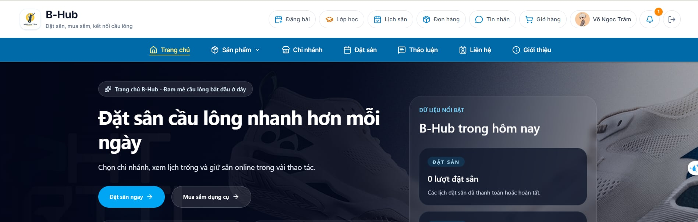

# Phát triển nền tảng Web quản lý chuỗi sân cầu lông đa cơ sở hỗ trợ phân tích dữ liệu và thương mại điện tử

*Dự án KLTN — B‑Hub (Badminton Court Booking & Management System)*

[](#) [](#) [](#)



---

## Mục lục

- [Giới thiệu](#giới-thiệu)
- [Vai trò trong hệ thống](#vai-trò-trong-hệ-thống)
- [Tính năng theo vai trò](#tính-năng-theo-vai-trò)
- [Tính năng nền tảng](#tính-năng-nền-tảng)
- [Công nghệ](#công-nghệ)
- [Kiến trúc](#kiến-trúc)
- [Cài đặt & chạy dự án](#cài-đặt--chạy-dự-án)
- [Đường dẫn ứng dụng](#đường-dẫn-ứng-dụng)
- [Cấu trúc thư mục](#cấu-trúc-thư-mục)
- [Tác giả](#tác-giả)

---

## Giới thiệu

**B-Hub** (Badminton Court Booking & Management System) là hệ thống web full-stack phục vụ chuỗi cơ sở cầu lông: khách hàng đặt sân và mua sắm trực tuyến, nhân viên xử lý tại quầy, quản lý chi nhánh vận hành hàng ngày, admin giám sát toàn hệ thống. Nền tảng tích hợp thanh toán VNPay, ví nội bộ, chat real-time, cộng đồng người chơi, huấn luyện viên (HLV) và trợ lý AI.

Dự án được thực hiện trong khuôn khổ **Tiểu luận chuyên ngành** — Khoa Công nghệ Thông tin, Trường Đại học Sư phạm Kỹ thuật TP.HCM.

---

## Vai trò trong hệ thống

Hệ thống có **5 vai trò** (`ROLE_NAME`), mỗi vai trò có portal và phân quyền API riêng:

| Vai trò | Portal | Mô tả ngắn |
|---------|--------|------------|
| **USER** | `/`, `/bookings`, … | Khách hàng: đặt sân, mua hàng, cộng đồng |
| **COACH** | Cùng portal User | HLV: quản lý lớp học, học viên (sau khi được admin duyệt) |
| **EMPLOYEE** | `/employee` | Nhân viên quầy: ca làm, thu ngân, xử lý đơn & lịch sân |
| **MANAGER** | `/manager` | Quản lý chi nhánh: nhân sự, kho, doanh thu, lịch sân |
| **ADMIN** | `/admin` | Quản trị toàn hệ thống: người dùng, tài chính, báo cáo |

> **COACH** dùng chung giao diện khách hàng (`UserProtectedRoute` chấp nhận `USER` và `COACH`), nhưng có thêm quyền đăng bài lớp học và trang quản lý học viên.

---

## Tính năng theo vai trò

### Khách hàng — `USER`

<details>
<summary><strong>Tài khoản & bảo mật</strong></summary>

- Đăng ký, đăng nhập, xác thực **OTP qua email** (đăng ký, đặt lại mật khẩu, thanh toán ví, rút tiền)
- Quên mật khẩu / đặt lại mật khẩu
- JWT access token + refresh token, tự làm mới phiên
- Hồ sơ cá nhân, avatar (Cloudinary), hồ sơ công khai người dùng khác

</details>

<details>
<summary><strong>Đặt sân</strong></summary>

- Duyệt chi nhánh, xem sân và lịch khả dụng theo khung giờ
- Đặt sân đơn / nhiều khung giờ trong một lần
- **Đặt sân theo tháng** (monthly booking) — tính phí & tạo lịch định kỳ
- Thanh toán: **COD** (tại sân) · **VNPay** · **Ví B-Hub** (xác nhận OTP)
- Xem chi tiết đặt sân, lịch sử đặt, hủy / gửi yêu cầu hủy
- Áp dụng mã giảm giá cho đặt sân (`BOOKING` / `ALL`)

</details>

<details>
<summary><strong>Mua sắm & đơn hàng</strong></summary>

- Danh mục sản phẩm cầu lông (biến thể, ảnh, tồn kho)
- Giỏ hàng, checkout, quản lý địa chỉ giao nhận
- Thanh toán: COD · VNPay · Ví B-Hub
- Theo dõi đơn hàng, đánh giá sản phẩm, yêu cầu trả hàng / hủy đơn
- Áp dụng mã giảm giá đơn hàng (`ORDER` / `ALL`)

</details>

<details>
<summary><strong>Ví điện tử</strong></summary>

- Nạp tiền qua VNPay
- Thanh toán đặt sân & đơn hàng bằng số dư ví
- Yêu cầu rút tiền (OTP xác nhận), xem lịch sử giao dịch

</details>

<details>
<summary><strong>Cộng đồng & tin nhắn</strong></summary>

- Đăng bài 5 loại:
  - **Tìm người chơi** · **Tìm HLV** · **Lớp học** · **Giải đấu** · **Nhóm**
- Lọc bài theo trình độ, chi nhánh, ngày, khu vực…
- Thích, bình luận, chia sẻ (repost) bài viết
- Chat 1-1 và nhóm, gửi file/ảnh, thông báo tin nhắn real-time
- Tìm kiếm người dùng

</details>

<details>
<summary><strong>HLV & lớp học (phía học viên)</strong></summary>

- Đăng ký trở thành HLV (`/become-coach`) — nộp hồ sơ & chứng chỉ, chờ admin duyệt
- Đăng ký tham gia lớp học từ bài đăng `CLASS`
- Trang **Lớp của tôi** — theo dõi trạng thái đăng ký lớp

</details>

<details>
<summary><strong>Trang chủ & tiện ích</strong></summary>

- Trang chủ: banner, sản phẩm nổi bật, chi nhánh hot, khuyến mãi, đánh giá khách hàng
- Trang Giới thiệu, Liên hệ
- Gửi phản hồi (feedback) sản phẩm / dịch vụ
- Thông báo in-app (Socket.IO) — xác nhận đặt sân, đơn hàng, duyệt HLV…
- **Trợ lý AI** — chat widget 4 ngữ cảnh: Tổng quát · Đặt sân · Mua sắm · HLV/Lớp

</details>

---

### Huấn luyện viên — `COACH`

Kế thừa toàn bộ tính năng **USER**, bổ sung:

| Tính năng | Chi tiết |
|-----------|----------|
| Đăng bài **Lớp học** | Chỉ COACH được tạo bài `CLASS` (USER tạo các loại khác) |
| Quản lý học viên | `/coach/students` — duyệt/từ chối đăng ký, cập nhật trạng thái học viên |
| Quản lý lớp | Xem danh sách lớp, cập nhật trạng thái lớp, thêm học viên thủ công |
| Nhóm lớp học | Tạo/mở hội thoại nhóm lớp, gửi thông báo cho học viên |
| Hồ sơ HLV | Trang profile hiển thị thông tin chứng chỉ, kinh nghiệm |

---

### Nhân viên — `EMPLOYEE` · `/employee`

<details>
<summary><strong>Ca làm việc & thu ngân</strong></summary>

- Xem lịch ca được phân công (thu ngân `CASHIER` / nhân viên `STAFF`)
- **Check-in / Check-out ca** — nhập tiền mặt đầu ca & cuối ca
- Chỉ nhân viên đã check-in ca thu ngân mới truy cập POS và xử lý đơn/lịch

</details>

<details>
<summary><strong>POS tại quầy (Counter)</strong></summary>

- Bảng lịch sân theo thời gian thực (court board)
- Bán **sản phẩm** & **đồ uống** tại quầy
- Tạo đơn nháp (draft), chỉnh sửa, thanh toán tại quầy (offline order/booking)
- Thanh toán: tiền mặt · chuyển khoản · ví khách

</details>

<details>
<summary><strong>Xử lý lịch đặt sân</strong></summary>

- Xem danh sách & chi tiết đặt sân
- Xác nhận · tiếp nhận sân (check-in) · hoàn thành
- Duyệt / từ chối yêu cầu hủy của khách
- Hủy lịch no-show (khách không đến)

</details>

<details>
<summary><strong>Xử lý đơn hàng</strong></summary>

- Xác nhận đơn → chuẩn bị → sẵn sàng giao → giao hàng
- Từ chối / hủy đơn, cập nhật trạng thái fulfillment

</details>

---

### Quản lý chi nhánh — `MANAGER` · `/manager`

| Module | Chức năng |
|--------|-----------|
| **Dashboard** | Tổng quan vận hành chi nhánh |
| **Lịch đặt sân** | Xem & quản lý booking schedule |
| **Sân / Chi nhánh** | Quản lý court, thông tin chi nhánh |
| **Sản phẩm & Đồ uống** | CRUD sản phẩm, đồ uống tại chi nhánh |
| **Đơn hàng** | Theo dõi & xử lý đơn chi nhánh |
| **Nhân viên** | Quản lý staff chi nhánh |
| **Ca làm & Lương** | Phân ca, theo dõi ca, bảng lương |
| **Doanh thu** | Báo cáo doanh thu chi nhánh |
| **Kho hàng** | Tồn kho, biến động kho tại chi nhánh |
| **Nhà cung cấp & Nhập kho** | Phiếu nhập, quản lý supplier |
| **Tin nhắn** | Hỗ trợ khách hàng qua chat |

---

### Quản trị viên — `ADMIN` · `/admin`

| Module | Chức năng |
|--------|-----------|
| **Dashboard** | Thống kê tổng quan toàn hệ thống |
| **Người dùng** | CRUD user, khóa/mở tài khoản, phân quyền |
| **Duyệt HLV** | Xem & duyệt/từ chối đơn đăng ký huấn luyện viên |
| **Chi nhánh** | Quản lý chi nhánh, sân, giá sân, ảnh |
| **Quản lý chi nhánh** | Gán/bỏ manager cho chi nhánh, đổi vai trò |
| **Danh mục** | Quản lý category & nhóm danh mục |
| **Sản phẩm & Đồ uống** | CRUD toàn hệ thống, biến thể, ảnh |
| **Bài đăng** | Kiểm duyệt bài cộng đồng, quản lý bình luận |
| **Khuyến mãi** | Mã giảm giá (% / số tiền), áp dụng ORDER / BOOKING / ALL |
| **Phản hồi** | Quản lý feedback khách hàng |
| **Tài chính** | Ví người dùng, giao dịch, duyệt/từ chối rút tiền, khóa ví |
| **Doanh thu** | Báo cáo online/offline theo chi nhánh, ngày, tháng, sản phẩm, đồ uống |
| **Nhà cung cấp** | CRUD supplier |
| **Phiếu nhập kho** | Quản lý purchase receipt |
| **Tồn kho** | Tồn kho & lịch sử biến động toàn hệ thống |

---

## Tính năng nền tảng

### Thanh toán

| Phương thức | Đặt sân | Đơn hàng | Nạp ví |
|-------------|---------|----------|--------|
| COD (tại sân / khi nhận hàng) | ✓ | ✓ | — |
| VNPay | ✓ | ✓ | ✓ |
| Ví B-Hub | ✓ (OTP) | ✓ (OTP) | — |

### Real-time (Socket.IO)

- Room theo user (`user:{id}`), vai trò (`role:{role}`), hội thoại (`conversation:{id}`)
- Push thông báo: đặt sân, đơn hàng, tin nhắn, duyệt HLV…

### Trợ lý AI (OpenAI)

- 4 ngữ cảnh: `general` · `booking` · `shopping` · `coach`
- Tool-calling: tra cứu chi nhánh, sân trống, sản phẩm, lớp học
- Hỗ trợ khách và cả người chưa đăng nhập (guest session)
- Streaming response

### Mã giảm giá

- Loại: giảm **số tiền** hoặc **phần trăm**
- Phạm vi: đơn hàng · đặt sân · cả hai

---

## Công nghệ

<table>
<tr>
<td width="50%" valign="top">

**Frontend** — `frontend/`

- React 19 · TypeScript · Vite 7
- Redux Toolkit · Redux Persist
- Ant Design · Tailwind CSS 4
- React Router 7 · React Hook Form · Zod
- Socket.IO Client · Leaflet (bản đồ)
- Chart.js · Recharts · Framer Motion

</td>
<td width="50%" valign="top">

**Backend** — `backend/`

- Node.js · Express 5 · Babel
- Sequelize ORM · MySQL
- Redis · BullMQ (job queue)
- Socket.IO v4
- JWT · Joi validation
- Cloudinary · Nodemailer
- VNPay SDK · OpenAI API

</td>
</tr>
</table>

---

## Kiến trúc

```
┌──────────────────────────────────────────────────────────────────┐
│                         Browser (Client)                          │
│   USER/COACH  │  ADMIN  │  MANAGER  │  EMPLOYEE  │  AI Widget   │
└────────────────────────────┬─────────────────────────────────────┘
                             │  REST API  +  WebSocket (Socket.IO)
┌────────────────────────────▼─────────────────────────────────────┐
│                      Express API Server                           │
│         Controllers → Services → Models (Sequelize)               │
│    JWT Auth │ RBAC (5 roles) │ Joi │ Multer/Cloudinary          │
└──────────────┬──────────────────────────────┬────────────────────┘
               │                              │
        ┌──────▼──────┐                ┌──────▼──────┐
        │    MySQL    │                │    Redis    │
        │  60+ models │                │   BullMQ    │
        └─────────────┘                └─────────────┘
```

---

## Cài đặt & chạy dự án

### Yêu cầu

- Node.js 18+
- MySQL
- Redis

### Backend

```bash
cd backend
npm install
```

Tạo `backend/.env`:

```env
PORT=8080
DB_HOST=localhost
DB_USER=root
DB_PASSWORD=
DB_NAME=badminton_booking

JWT_ACCESS_SECRET=your_access_secret
JWT_REFRESH_SECRET=your_refresh_secret

EMAIL_USER=your_email@gmail.com
EMAIL_PASS=your_app_password

CLOUD_NAME=your_cloudinary_name
API_KEY=your_cloudinary_key
API_SECRET=your_cloudinary_secret

VNP_TMN_CODE=
VNP_HASH_SECRET=
VNP_URL=https://sandbox.vnpayment.vn/paymentv2/vpcpay.html
VNP_RETURN_URL=http://localhost:5173/wallet/deposit/success
VNP_IPN_URL=http://localhost:8080/user/webhook/vnpay

OPENAI_API_KEY=           # Trợ lý AI (tuỳ chọn)
CLIENT_URL=http://localhost:5173

NODE_ENV=development
```

```bash
npm run dev    # http://localhost:8080
```

### Frontend

```bash
cd frontend
npm install
```

Tạo `frontend/.env`:

```env
VITE_BACKEND_URL=http://localhost:8080
VITE_SOCKET_URL=http://localhost:8080
```

```bash
npm run dev    # http://localhost:5173
```

### Scripts hữu ích

| Lệnh | Thư mục | Mô tả |
|------|---------|-------|
| `npm run dev` | `backend/` | Chạy API (nodemon + Babel) |
| `npm run build` | `backend/` | Build → `dist/` |
| `npm run dev` | `frontend/` | Vite dev server |
| `npm run build` | `frontend/` | Type-check + production build |
| `npm run lint` | `frontend/` | ESLint |

---

## Đường dẫn ứng dụng

| Portal | URL | Vai trò |
|--------|-----|---------|
| Khách hàng / HLV | `http://localhost:5173/` | USER, COACH |
| Admin | `http://localhost:5173/admin` | ADMIN |
| Manager | `http://localhost:5173/manager` | MANAGER |
| Employee | `http://localhost:5173/employee` | EMPLOYEE |

---

## Cấu trúc thư mục

```
project-badminton-booking/
├── backend/
│   └── src/
│       ├── config/          # DB, Redis
│       ├── constants/       # Enum & hằng số nghiệp vụ
│       ├── controllers/     # Route handlers
│       ├── services/        # Business logic
│       ├── models/          # 60+ Sequelize models
│       ├── routes/
│       │   ├── user/        # API khách hàng & HLV
│       │   ├── admin/       # API quản trị
│       │   ├── manager/     # API quản lý chi nhánh
│       │   └── employee/    # API nhân viên
│       ├── middlewares/     # Auth, RBAC, upload, validate
│       ├── socket/          # Socket.IO
│       └── validations/     # Joi schemas
│
└── frontend/
    └── src/
        ├── pages/           # Trang theo vai trò
        ├── components/      # UI components
        ├── redux/           # State management
        ├── services/        # Axios API calls
        ├── routes/          # React Router
        └── schemas/         # Zod validation
```

---

## Tác giả

| | |
|---|---|
| **Sinh viên thực hiện** | Nguyễn Tuấn Thành · Huỳnh Thái Toàn |
| **Giảng viên hướng dẫn** | ThS. Vũ Đình Bảo |
| **Trường** | Đại học Sư phạm Kỹ thuật TP. Hồ Chí Minh |
| **Khoa** | Công nghệ Thông tin |

---

<div align="center">

*Dự án KLTN — B-Hub · Badminton Court Booking & Management System*

</div>
